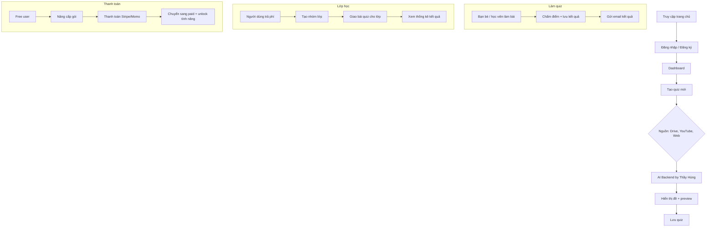

# QUIZ PLATFORM – FUNCTIONAL SPECIFICATION & COMPENSATION PLAN

## 🔧 1. MÔ HÌNH TRIỂN KHAI THEO TÍNH NĂNG

Chúng tôi không tính lương theo giờ mà tính **theo từng tính năng cụ thể** với đầu ra rõ ràng. Dự án có thể trả:
- **Option A**: Thanh toán ngay theo từng tính năng đã hoàn thành
- **Option B**: Cùng đồng hành lâu dài, hưởng phần trăm doanh thu thực tế của hệ thống (ví dụ: 10–20%)

---

## 📦 2. DANH SÁCH TÍNH NĂNG & DEAL LƯƠNG DỰ KIẾN

| Mã | Tính năng | Mô tả kỹ thuật | Giao diện | Mức độ | Giá đề xuất (VNĐ) |
|----|-----------|----------------|-----------|--------|-------------------|
| F1 | Đăng ký / Đăng nhập | OAuth Google + Email-Password, Firebase Auth / Supabase | Login / Register page | Trung bình | 800.000 |
| F2 | Dashboard người dùng | Trang chủ cá nhân, hiển thị các quiz đã tạo / đã làm, loại tài khoản | Dashboard UI | Dễ | 500.000 |
| F3 | Tạo & quản lý quiz | Form nhập quiz (title, tag, câu hỏi), lưu DB, phân loại public/private | Quiz form | Trung bình | 1.200.000 |
| F4 | Làm quiz + chấm điểm | Giao diện làm bài, countdown, chọn đáp án, xử lý chấm điểm + lưu kết quả | Quiz play UI | Khá phức tạp | 1.500.000 |
| F5 | Tích hợp AI tạo quiz | Gửi link tài liệu → AI backend của thầy Hùng → nhận JSON quiz | Form gửi + preview | Cao | 2.000.000 |
| F6 | Tạo lớp học | Giao diện tạo lớp học, mời thành viên, giao quiz cho lớp | Class management | Trung bình | 1.200.000 |
| F7 | Thống kê kết quả | Bảng điểm học viên, thống kê theo lớp / theo quiz | Result page | Trung bình | 1.000.000 |
| F8 | Thanh toán + phân quyền | Tích hợp Stripe/Momo, phân loại free/paid, lưu hạn | Payment + logic backend | Trung bình | 1.200.000 |
| F9 | Quản lý hệ thống (Admin) | Danh sách user, thống kê sử dụng, bật/tắt quiz, xoá user | Admin panel UI | Trung bình | 1.000.000 |
| F10 | Email thông báo kết quả | Gửi email tự động sau khi làm quiz, dùng Resend / Brevo | No UI | Dễ | 500.000 |

### 📌 Ghi chú:
- Mỗi tính năng được **test và review** trước khi chốt thanh toán
- Có thể chia nhỏ hơn nếu cần
- Nếu chọn **Option B (doanh thu)**, nhóm sẽ giữ log tracking user upgrade để chia lợi nhuận công bằng

---

## ⚙ 3. CHÍNH SÁCH HỢP TÁC (FREELANCER HOẶC ĐỒNG SÁNG LẬP)

### Option A – Trả theo tính năng
- Thanh toán qua MoMo / ngân hàng
- Ứng trước theo từng cụm tính năng

### Option B – Cổ phần / chia doanh thu
- Cộng tác viên / dev nhận từ **10–20% doanh thu thực tế**
- Có hợp đồng / giấy cam kết
- Quy định rõ thời gian làm việc, trách nhiệm bảo trì, chia lợi nhuận mỗi quý/tháng

---

## 💡 4. CHIẾN LƯỢC KẾT HỢP

| Chiến lược | Mô tả |
|-----------|-------|
| Giai đoạn đầu | Trả cứng theo từng tính năng, đảm bảo tiến độ |
| Giai đoạn sau | Cộng tác lâu dài, nhận phần trăm khi nền tảng ra mắt chính thức |
| Ưu tiên | Người hiểu hệ thống từ đầu sẽ có lợi thế bảo trì, scale & hưởng lợi nhuận |

---

## 🔍 5. GỢI Ý PHÁT TRIỂN LÂU DÀI

- Web app → Mobile app
- Tạo chứng chỉ / gamification
- Đa ngôn ngữ
- Mở mô hình SaaS cho giáo viên / trung tâm khác

---

## 📈 6. KPI & THÀNH QUẢ KỲ VỌNG

| Chỉ số | Mục tiêu |
|--------|----------|
| Thời gian hoàn thành MVP | 6–8 tuần |
| Người dùng đầu tiên | 1000 người |
| Doanh thu tháng đầu | > 5 triệu VND |
| Tỉ lệ trả phí | 10–15% người dùng free |

---

## 🧭 7. FLOW DỰ ÁN (MERMAID)

---

