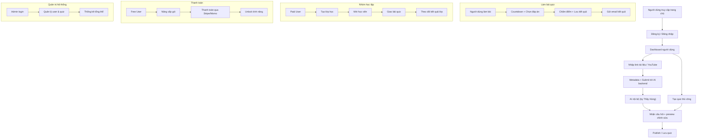

# QUIZ PLATFORM – FUNCTIONAL SPECIFICATION & COMPENSATION PLAN

## 1. TỔNG QUAN DỰ ÁN

Xây dựng nền tảng quiz chuyên nghiệp với các tính năng:
- Tạo đề & làm bài
- Quản lý nhóm lớp học
- Tích hợp AI tạo câu hỏi từ tài liệu (Thầy Hùng phụ trách AI backend, host nội bộ)
- Hệ thống phân loại người dùng, thanh toán, lưu kết quả
- Giao diện webapp responsive, tối giản, tinh gọn, hướng đến người dùng mobile

> 🤝 **Nhân sự chính**:
> - **Minh**: Phát triển frontend, backend, giao diện người dùng  
> - **Thầy Hùng**: Phụ trách AI backend (Python, host nội bộ)  
> - **Cộng tác viên**: Được giao các chức năng cụ thể theo milestone

---

## 2. DANH SÁCH CHỨC NĂNG & CHI PHÍ THEO MODULE

| Mã  | Tính năng                  | Mô tả kỹ thuật                                      | Giao diện            | Độ phức tạp | Giá đề xuất (VNĐ) |
|-----|----------------------------|-----------------------------------------------------|----------------------|-------------|-------------------|
| F1  | Đăng ký / Đăng nhập        | Firebase Auth / Supabase                            | Login UI             | Trung bình  | 800.000           |
| F2  | Dashboard người dùng       | Danh sách quiz đã tạo/làm, loại tài khoản           | UI đơn giản          | Dễ          | 500.000           |
| F3  | Tạo & quản lý quiz         | CRUD quiz, lưu DB, publish/private                  | Quiz form UI         | Trung bình  | 1.200.000         |
| F4  | Làm quiz + chấm điểm       | Countdown, chọn đáp án, chấm tự động                | Giao diện quiz       | Khá cao    | 1.500.000         |
| F5  | Tích hợp AI quiz           | Nhận link → gửi Thầy Hùng → render quiz             | Form + preview       | Cao         | 2.000.000         |
| F6  | Quản lý lớp học            | Tạo nhóm, mời thành viên, gán quiz                  | UI lớp học           | Trung bình  | 1.200.000         |
| F7  | Thống kê kết quả           | Theo quiz, theo lớp, hiển thị bảng điểm             | Bảng kết quả         | Trung bình  | 1.000.000         |
| F8  | Thanh toán & phân quyền    | Stripe/Momo + quản lý gói Free/Paid                   | Form + logic         | Trung bình  | 1.200.000         |
| F9  | Admin dashboard           | Quản lý người dùng, quiz, thống kê hệ thống         | UI quản trị          | Trung bình  | 1.000.000         |
| F10 | Email thông báo kết quả    | Gửi mail tự động sau khi làm quiz (Resend/Brevo)     | Không cần UI         | Dễ          | 500.000           |

---

## 3. MÔ HÌNH HỢP TÁC

### Option A – Trả theo từng chức năng (khuyến khích giai đoạn đầu)
- Mỗi module được giao task riêng
- Kiểm thử → nghiệm thu → thanh toán

### Option B – Chia doanh thu thực tế
- Sau khi đạt MVP/V1
- Cộng tác viên nhận **10–20% doanh thu ròng hàng tháng**
- Theo dõi và log việc nâng cấp tài khoản để chia minh bạch

---

## 4. KẾ HOẠCH THEO MILESTONE

| Mốc | Chức năng chính      | Kết quả đầu ra                 | Thời gian    |
|-----|----------------------|--------------------------------|--------------|
| M1  | F1 + F2              | Auth + Dashboard               | 1 tuần       |
| M2  | F3 + F4              | CRUD quiz + làm bài quiz       | 1–1.5 tuần   |
| M3  | F5                   | Tích hợp AI: tạo đề quiz       | 1–1.5 tuần   |
| M4  | F6 + F7              | Quản lý lớp học + thống kê      | 1 tuần       |
| M5  | F8 + F9 + F10        | Thanh toán, admin, email       | 1–1.5 tuần   |

---

## 5. RỦI RO KỸ THUẬT & PHƯƠNG ÁN PHÒNG HỜ

| Rủi ro                       | Mô tả                                                       | Giải pháp                                                  |
|------------------------------|-------------------------------------------------------------|------------------------------------------------------------|
| ⚠ API rate-limit             | Backend AI vượt quota khi nhiều người dùng                 | Giới hạn request/user, proxy queue, sử dụng cache nội bộ    |
| ⚠ Quá tải server nội bộ      | AI backend (host local bởi Thầy Hùng) có thể bị timeout       | Triển khai thêm instance phụ trợ, xử lý batch, mở rộng server|
| ⚠ Abuse tài khoản miễn phí   | Người dùng spam tạo quiz liên tục                            | Xác thực CAPTCHA, giới hạn theo IP, tăng cường kiểm tra role|
| ⚠ Thất thoát dữ liệu         | Mất quiz do lỗi AI hoặc kết nối mạng                         | Lưu auto-draft, backup định kỳ                             |
| ⚠ Quản lý file media nặng    | PDF, video lớn gây chậm hệ thống                             | Sử dụng Cloudinary/Google Drive cho lưu trữ file lớn         |
| ⚠ Gửi email lỗi/spam         | Resend quota giới hạn, domain chưa verify                     | Cấu hình SPF/DKIM, dùng dịch vụ email uy tín, gửi theo lô    |

---

## 6. FLOW TOÀN BỘ DỰ ÁN (MERMAID)

---

## 7. TESTING & QUALITY ASSURANCE (QA)

- **Responsive Design Testing**: Kiểm tra ứng dụng trên nhiều thiết bị (mobile, tablet, desktop) bằng các công cụ như BrowserStack.
- **UI/UX Testing**: Đánh giá giao diện tối giản, tinh gọn, thân thiện với người dùng mobile; thu thập feedback từ nhóm thử nghiệm.
- **Unit & Integration Testing**: Áp dụng các framework như Jest, React Testing Library cho frontend và Mocha/Chai cho backend.
- **Performance Testing**: Load testing cho AI backend và API, đảm bảo xử lý đồng thời nhiều request.
- **Security Testing**: Kiểm tra xác thực (JWT, Role-based access), phòng chống các tấn công (SQL injection, XSS, CSRF).
- **Risk Simulation Testing**: Mô phỏng các kịch bản rủi ro (quá tải, API rate-limit, thất thoát dữ liệu) để đảm bảo hệ thống phục hồi nhanh chóng.

---

## 8. GỢI Ý PHÁT TRIỂN LÂU DÀI

- Phát triển **mobile app** (React Native/Flutter) để tối ưu trải nghiệm người dùng di động.
- Tích hợp **LMS / Moodle API** mở rộng hệ thống giáo dục.
- Tạo chứng chỉ tự động sau khi hoàn thành quiz.
- Mở rộng mô hình SaaS cho các trường, trung tâm đào tạo.
- Tích hợp AI scoring và phân tích dữ liệu học tập.

---

## 9. TRIỂN KHAI

> Xác nhận các chức năng ưu tiên để triển khai ngay:  
> - Chọn phương thức thanh toán: **Trả theo chức năng** hay **Chia doanh thu**.  
> - Sắp xếp thứ tự ưu tiên dựa trên milestone.  
> - Minh sẽ tổng hợp và tạo tài liệu hợp đồng, kanban công việc và tracking kết quả.

---
