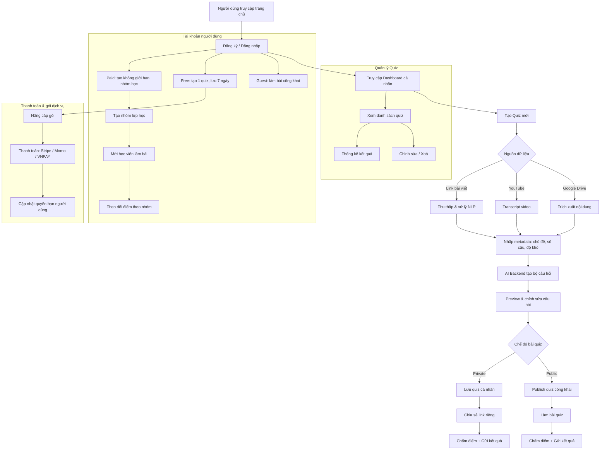

# QUIZ WEBSITE - TECHNICAL SPECIFICATION

## 1. PROJECT DESCRIPTION

Nâng cấp nền tảng làm quiz hiện có (Google Apps Script + Google Sheet) thành một **nền tảng web chuyên nghiệp** phục vụ cho việc tạo đề, làm bài và chấm điểm, hỗ trợ người dùng tự động tạo câu hỏi bằng AI, quản lý lớp học, và tích hợp hệ thống thanh toán.

---

## 2. CORE MODULES

### 2.1 User Management
- Đăng ký / Đăng nhập qua Google hoặc Email-Password
- Phân loại người dùng: Guest, Free, Paid
- Dashboard cá nhân, thông tin gói, lịch sử

### 2.2 Quiz Management
- CRUD quiz (tạo, sửa, xoá, cập nhật)
- Phân loại quiz: công khai, riêng tư, miễn phí, trả phí
- Hạn lưu trữ tuỳ theo loại tài khoản
- Thống kê số lượt làm bài, điểm trung bình

### 2.3 AI Quiz Generation
- Nhập link tài liệu (Drive, YouTube, Web)
- Phân loại nội dung, số lượng câu hỏi, độ khó
- AI sinh câu hỏi trắc nghiệm dựa vào nội dung
- Preview + chỉnh sửa nội dung quiz

### 2.4 Quiz Taking & Result
- Countdown timer, random câu hỏi
- Gửi kết quả qua email
- Hiển thị đáp án và thống kê

### 2.5 Class & Group Management
- Tài khoản trả phí tạo nhóm lớp học
- Giao quiz theo lớp
- Theo dõi kết quả học viên

### 2.6 Payment Integration
- Thanh toán gói: theo tháng/năm
- Thanh toán từng bài quiz
- Tự động gia hạn
- Hỗ trợ Stripe / Momo / VNPAY

---

## 3. TECH STACK

| Layer      | Technology                          |
|------------|--------------------------------------|
| Frontend   | React.js + TailwindCSS (Next.js)     |
| Backend    | Node.js + Express / NestJS           |
| Auth       | Firebase Auth / Supabase             |
| Database   | PostgreSQL / MongoDB (Cloud hosted)  |
| AI Service | OpenAI / Claude API                  |
| Storage    | Firebase / Supabase                  |
| Payment    | Stripe, Momo, VNPAY                  |
| Hosting    | Vercel (frontend), Railway (backend) |

---

## 4. ESTIMATED INFRA COST (Monthly)

| Hạng mục         | Chi phí dự kiến |
|------------------|-----------------|
| Hosting Frontend | Miễn phí (Vercel) |
| Backend + DB     | $10–20          |
| AI Calls         | $20–30          |
| Email / Storage  | $5–10           |
| Domain           | $1–2            |
| Tổng cộng        | ~$30–60         |

---

## 5. FLOW DIAGRAM (MERMAID)

---

## 6. DEPLOYMENT ROADMAP

| Giai đoạn | Tính năng chính                         | Thời gian   |
|-----------|------------------------------------------|-------------|
| Phase 1   | Đăng nhập, tạo quiz, lưu kết quả         | 2–3 tuần    |
| Phase 2   | Tích hợp AI sinh đề, preview + publish   | 2–3 tuần    |
| Phase 3   | Nhóm lớp học, thống kê theo nhóm         | 2 tuần      |
| Phase 4   | Thanh toán, giới hạn gói, email          | 1–2 tuần    |
| Tổng      | **8–10 tuần**                            |             |

---

## 7. METRICS FOR SUCCESS

- Quiz được tạo từ AI trong < 30 giây
- Chi phí hạ tầng cho 1000 user < $60/tháng
- 10–15% tỉ lệ chuyển đổi sang tài khoản trả phí
- >30% người dùng quay lại dùng trong vòng 1 tháng

---
